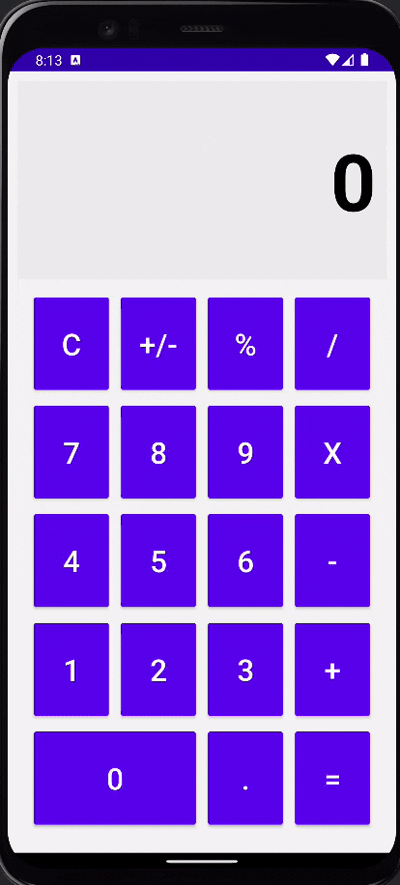
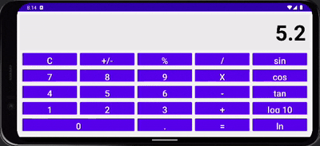

# Android Calculator App
A modern and fully functional **Android calculator app** built to mimic the functionality and design of the mobile phone default calculator.

This app allows users to perform **basic arithmetic operations (addition, subtraction, multiplication, division)**, toggle positive/negative values, calculate percentages, handle decimal inputs, and now supports orientation changes and scientific calculations.

---

## **📌 Functionality**
### ✅ **Core Features (Required)**
- [x] **Fully functional calculator UI** with number buttons, operators, and a display screen.
- [x] **Arithmetic Operations:** Perform **addition (+), subtraction (-), multiplication (×), and division (÷).**
- [x] **Clear (C) Button:** Resets all input fields and stored values.
- [x] **Positive/Negative Toggle (+/-):** Allows users to change the sign of a number.
- [x] **Percentage Calculation (%):** Converts a number into its percentage value.
- [x] **Handles Decimal Input (.)**: Supports fractional numbers.
- [x] **Result Formatting:**
  - Displays whole numbers without .0 (e.g., 5 + 5 = 10).
  - Shows decimal results only when necessary (e.g., 5 / 2 = 2.5).
- [x] **Orientation Persistence:** Input values and operators persist when switching between portrait and landscape modes.
- [x] **Button Click Logging:** Every button press is logged using `Log.d(TAG, ...)`.
- [x] **Scientific Functions (Landscape Only):** Includes **sin**, **cos**, **tan**, **log10**, and **ln**.

---

### 🚀 **Additional Features (Extensions)**
- 🎨 **Visually Appealing UI:**
  - `C` button is **Purple** 🟣
  - Operators (÷, ×, −, +, =) are **Purple** 🟣
  - Number buttons (0-9) are **Purple** 🟣
- 🖼️ **Calculator Icon:** Updated to a calculator symbol.
- 📏 **Responsive Layout:** Optimized for different screen sizes with distinct **portrait** and **landscape** layouts.

---

## **📹 Video Walkthrough**
Here's a walkthrough demonstrating of both functionality:

**Portrait**

**Landscape**

---

## **📝 Notes & Challenges Faced**
### **🔁 Orientation Persistence**
- Used lifecycle methods `onSaveInstanceState()` and `onRestoreInstanceState()` to retain user input during orientation changes.

### **📋 Logging User Interaction**
- Added logs for each button press using `Log.d(TAG, ...)`, which can be viewed in **LogCat**.

### **📱 Dual Layouts for Portrait & Landscape**
- Created separate XML layouts for **portrait** and **landscape** modes.
- Added null-checks for landscape-only buttons to prevent crashes in portrait mode.

---

## **📜 License**
© 2025 Vardan Malik  
Licensed under the Apache License, Version 2.0 (the "License");  
you may not use this file except in compliance with the License.  
You may obtain a copy of the License at:

🔗 http://www.apache.org/licenses/LICENSE-2.0

Unless required by law or agreed to in writing, software  
distributed under the License is distributed on an "AS IS" BASIS,  
WITHOUT WARRANTIES OR CONDITIONS OF ANY KIND.  
See the License for the specific language governing permissions and limitations under the License.

